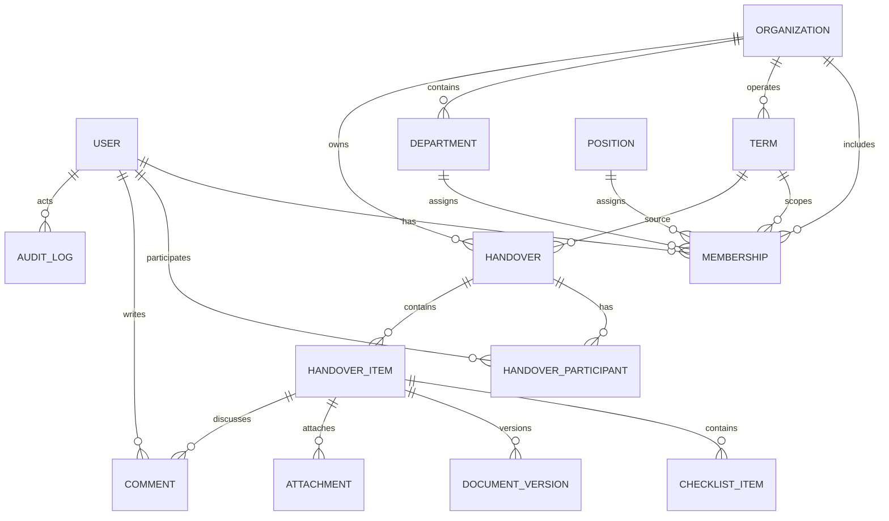
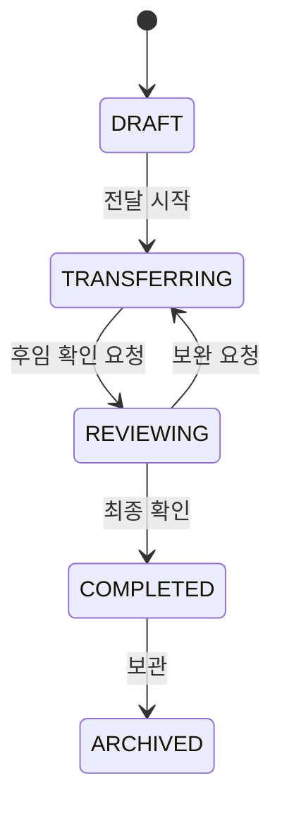
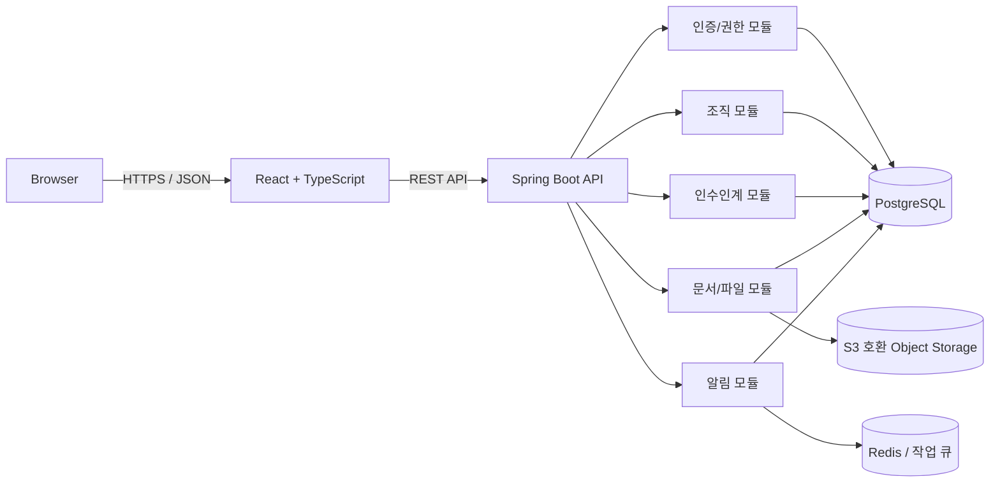

# Linkit 서비스 설계서

> 명지대학교 학생회를 위한 인수인계 플랫폼  
> 문서 상태: Draft v0.1  
> 작성일: 2026-07-30

## 1. 문서 목적

Linkit은 학생회 구성원이 임기 중 만든 업무 지식과 자료를 체계적으로 기록하고, 다음 임기 담당자에게 안전하게 전달할 수 있도록 돕는 플랫폼이다.

이 문서는 초기 제품 범위와 핵심 정책을 합의하기 위한 기준 문서다. 확정되지 않은 내용은 `가정` 또는 `검토 필요`로 표시한다.

## 2. 해결하려는 문제

- 인수인계 자료가 개인 메신저, 클라우드 드라이브, 로컬 파일 등에 흩어져 있다.
- 문서의 최신 버전과 실제 담당자를 파악하기 어렵다.
- 전임자 계정이 사라지거나 연락이 끊기면 업무 맥락도 함께 사라진다.
- 부서별 업무 일정, 주의 사항, 관련 파일을 한 번에 전달하기 어렵다.
- 민감한 회계·인사 자료가 불필요한 구성원에게 노출될 수 있다.
- 인수인계가 실제로 완료되었는지 조직 차원에서 확인하기 어렵다.

## 3. 제품 목표와 비목표

### 3.1 목표

- 조직과 임기 단위로 인수인계 자료를 축적한다.
- 업무별 문서, 첨부 파일, 체크리스트, 담당자를 한곳에서 관리한다.
- 전임자와 후임자가 인수인계 진행 상태를 함께 확인한다.
- 역할 기반 권한과 감사 기록으로 중요 자료를 보호한다.
- 검색을 통해 과거 임기의 업무 지식을 재사용할 수 있게 한다.

### 3.2 초기 버전의 비목표

- 학생회 회계 시스템 전체를 대체하지 않는다.
- 카카오톡, 이메일 등 범용 커뮤니케이션 도구를 대체하지 않는다.
- 교내 공식 전자결재 또는 학사 시스템을 대체하지 않는다.
- 모든 클라우드 드라이브와 양방향 동기화를 제공하지 않는다.
- 모바일 네이티브 앱을 별도로 개발하지 않는다. 반응형 웹을 우선한다.

## 4. 사용자와 조직 모델

### 4.1 사용자 유형

| 사용자 | 설명 | 주요 행동 |
|---|---|---|
| 플랫폼 관리자 | 서비스 전체를 관리하는 운영자 | 조직 승인, 신고 대응, 운영 정책 관리 |
| 조직 관리자 | 특정 학생회 조직의 대표 또는 권한 관리자 | 구성원 승인, 역할 부여, 임기 생성, 권한 관리 |
| 현임 구성원 | 현재 임기에 활동 중인 학생회 구성원 | 문서 작성, 파일 등록, 인수인계 생성 |
| 후임 구성원 | 다음 임기 담당자로 지정된 구성원 | 자료 열람, 질문, 체크리스트 확인, 인수 확인 |
| 전임/졸업 구성원 | 활동이 끝난 과거 구성원 | 허용된 기간과 범위 내에서 보완 및 질의 응답 |

### 4.2 조직 구조

조직은 계층 구조를 가질 수 있다.

```text
명지대학교
├── 인문캠퍼스
│   ├── 총학생회
│   ├── 단과대학 학생회
│   │   └── 학과 학생회
│   └── 기타 자치기구
└── 자연캠퍼스
    ├── 총학생회
    ├── 단과대학 학생회
    │   └── 학과 학생회
    └── 기타 자치기구
```

각 조직은 독립적인 구성원, 임기, 부서, 문서와 권한을 가진다. 상위 조직이라는 이유만으로 하위 조직의 비공개 자료를 자동 열람할 수는 없다.

### 4.3 임기와 직책

- `임기(Term)`: 예) 2027학년도 제53대 학생회
- `부서(Department)`: 예) 기획국, 재정국, 홍보국
- `직책(Position)`: 예) 회장, 국장, 부원
- 한 사용자는 같은 조직의 여러 임기에 참여할 수 있다.
- 권한은 사용자가 아니라 `조직 구성원 자격 + 임기 + 역할`에 부여한다.

## 5. 핵심 사용자 흐름

### 5.1 조직 개설

1. 사용자가 학교 이메일을 인증한다.
2. 조직 개설을 신청하고 소속, 조직 유형, 증빙 정보를 입력한다.
3. 플랫폼 관리자가 중복 여부와 신청 내용을 확인한다.
4. 승인 후 신청자가 최초 조직 관리자가 된다.
5. 조직 관리자가 임기, 부서, 직책을 설정한다.

### 5.2 구성원 가입

1. 사용자가 초대 링크 또는 가입 코드를 통해 조직 가입을 신청한다.
2. 조직 관리자가 소속 임기, 부서, 직책을 확인하여 승인한다.
3. 승인된 사용자에게 역할에 맞는 권한이 부여된다.

### 5.3 인수인계 진행

1. 현임자가 인수인계 공간을 만들고 후임자를 지정한다.
2. 업무별 인수인계 항목을 작성한다.
3. 문서, 링크, 파일, 일정, 체크리스트, 주의 사항을 등록한다.
4. 후임자가 내용을 확인하고 질문 또는 수정 요청을 남긴다.
5. 각 항목을 확인 처리한다.
6. 양측 또는 조직 관리자가 최종 완료 처리한다.
7. 완료본은 해당 임기의 읽기 전용 스냅샷으로 보존한다.

## 6. 기능 요구사항

### 6.1 MVP

#### 계정 및 인증

- `@mju.ac.kr` 학교 이메일만 회원가입 허용
- 학교 이메일 인증
- 로그인, 로그아웃, 비밀번호 재설정
- 이용약관 및 개인정보 처리방침 동의 이력
- 조직 가입 신청과 관리자 승인
- 계정 비활성화 및 탈퇴

#### 조직 및 권한

- 조직 생성 신청과 승인
- 임기, 부서, 직책 관리
- 구성원 초대, 승인, 역할 변경, 비활성화
- 역할 기반 접근 제어
- 자료별 공개 범위 설정

#### 인수인계

- 인수인계 공간 생성
- 전임자, 후임자, 담당 부서 지정
- 업무 항목 생성, 수정, 정렬, 보관
- 리치 텍스트 또는 Markdown 기반 본문
- 체크리스트와 진행률
- 댓글과 답글
- 상태 변경: `작성 중 → 전달 중 → 확인 중 → 완료`
- 완료 후 스냅샷 보존

#### 문서 및 파일

- 파일 첨부, 다운로드, 삭제
- 외부 링크 등록
- 파일 메타데이터와 업로더 기록
- 블록 기반 문서 편집
- Markdown 가져오기 및 내보내기
- 문서 자동 저장과 저장 상태 표시
- 제목, 본문, 태그, 파일명 검색
- 문서 변경 이력

#### 알림 및 운영

- 앱 내 알림
- 가입 승인, 담당자 지정, 댓글, 마감일 알림
- 주요 관리 행위 감사 로그

### 6.2 이후 확장

- 이메일 및 푸시 알림
- Google Drive, OneDrive 등 외부 저장소 연동
- 문서 템플릿과 조직 간 공개 템플릿 공유
- 캘린더 및 반복 업무
- 문서 비교와 특정 버전 복원
- 사용자별 커서와 변경 사항 병합을 지원하는 실시간 동시 편집
- 통합 검색 고도화
- 인수인계 완성도 분석
- AI 기반 요약, 누락 항목 탐지, 질의응답

AI 기능은 접근 권한이 있는 자료만 검색해야 하며, 사용자 동의 없이 민감 자료를 외부 모델 학습에 사용하지 않는 정책이 선행되어야 한다.

## 7. 권한 설계

### 7.1 기본 역할

| 기능 | 플랫폼 관리자 | 조직 관리자 | 편집자 | 열람자 |
|---|:---:|:---:|:---:|:---:|
| 조직 승인 | O | X | X | X |
| 조직 설정 변경 | 제한적 | O | X | X |
| 구성원/역할 관리 | 제한적 | O | X | X |
| 임기/부서 관리 | X | O | X | X |
| 인수인계 생성 | X | O | O | X |
| 문서 편집 | X | O | O | X |
| 허용 문서 열람 | 제한적 | O | O | O |
| 완료 승인 | X | O | 담당자 | X |
| 감사 로그 조회 | O | O | X | X |

플랫폼 관리자의 콘텐츠 열람은 장애 대응, 신고 처리 등 명시적인 사유가 있을 때만 허용하고 접근 자체를 감사 로그로 남긴다.

### 7.2 자료 공개 범위

- `조직 전체`: 해당 조직의 승인된 구성원
- `현재 임기`: 지정 임기의 구성원
- `부서`: 지정 임기와 부서의 구성원
- `담당자 전용`: 명시적으로 지정된 사용자
- `관리자 전용`: 조직 관리자

권한 판정은 모든 조회 및 변경 요청에서 서버가 수행한다. 프론트엔드의 메뉴 숨김은 보안 통제가 아니다.

## 8. 도메인 모델



### 8.1 주요 엔티티

| 엔티티 | 주요 필드 |
|---|---|
| User | id, email, name, studentNumber(암호화/선택), status, emailVerifiedAt |
| Organization | id, parentId, campus, type, name, status |
| Term | id, organizationId, name, startsAt, endsAt, status |
| Department | id, organizationId, name, parentId, sortOrder |
| Position | id, organizationId, name, role, sortOrder |
| Membership | id, userId, organizationId, termId, departmentId, positionId, role, status |
| Handover | id, organizationId, sourceTermId, targetTermId, title, status, dueAt, completedAt |
| HandoverParticipant | id, handoverId, userId, participantType |
| HandoverItem | id, handoverId, parentId, title, contentJson, plainText, contentVersion, visibility, status, sortOrder |
| ChecklistItem | id, handoverItemId, title, checked, checkedBy, checkedAt |
| DocumentVersion | id, handoverItemId, version, contentJson, plainText, createdBy, createdAt |
| Attachment | id, handoverItemId, storageKey, originalName, contentType, size, uploadedBy |
| Comment | id, handoverItemId, parentId, authorId, content, createdAt, deletedAt |
| Notification | id, userId, type, payload, readAt, createdAt |
| AuditLog | id, organizationId, actorId, action, targetType, targetId, metadata, createdAt |

모든 주요 테이블은 `created_at`, `updated_at`을 가지며, 업무 기록은 원칙적으로 물리 삭제 대신 보관 또는 소프트 삭제한다.

### 8.2 블록 문서 모델

인수인계 본문은 Notion과 유사한 블록 편집 방식으로 제공한다. 문서의 원본은 Markdown 문자열이 아니라 블록 배열을 포함한 JSON 문서로 저장한다.

```json
{
  "schemaVersion": 1,
  "blocks": [
    {
      "id": "01J...",
      "type": "heading",
      "props": {
        "level": 2
      },
      "content": [
        {
          "type": "text",
          "text": "축제 준비"
        }
      ]
    },
    {
      "id": "01K...",
      "type": "checklist",
      "props": {
        "checked": false
      },
      "content": [
        {
          "type": "text",
          "text": "학생지원팀에 대관 신청"
        }
      ]
    }
  ]
}
```

MVP에서 지원할 블록은 다음과 같다.

- 제목과 일반 본문
- 글머리 목록과 번호 목록
- 체크리스트
- 인용과 주의 사항
- 구분선
- 링크
- 이미지와 첨부 파일
- 표

담당자, 마감일 등 서비스 고유 정보를 블록에 직접 포함할지는 UX 검증 후 결정한다. 검색을 위해 블록 JSON에서 추출한 `plainText`를 함께 저장하되, `contentJson`을 원본 데이터로 취급한다.

블록 스키마에는 `schemaVersion`을 포함한다. 블록 속성이 변경될 때 기존 문서를 읽을 수 있도록 서버 또는 프론트엔드에서 순차 마이그레이션을 제공한다. 알 수 없는 블록을 임의로 삭제하지 않고 원본을 보존한다.

### 8.3 Markdown 호환

Markdown은 문서의 원본 저장 형식이 아니라 교환 형식으로 사용한다.

- Markdown 파일 또는 텍스트를 블록 문서로 가져올 수 있다.
- 블록 문서를 Markdown으로 내보낼 수 있다.
- 제목, 본문, 목록, 체크리스트, 인용, 구분선, 링크, 표를 우선 지원한다.
- 첨부 파일, 댓글, 담당자, 권한 등 Markdown으로 온전히 표현할 수 없는 정보는 별도 메타데이터로 유지한다.
- 가져오기 과정에서 지원하지 않는 문법은 가능한 한 일반 텍스트 또는 코드 블록으로 보존하고 사용자에게 변환 결과를 알린다.
- 내보내기 시 첨부 파일은 권한이 적용된 링크 또는 별도 압축 파일로 제공하는 방식을 검토한다.

### 8.4 자동 저장과 버전 관리

- 편집 내용은 짧은 지연 시간을 둔 자동 저장 방식으로 서버에 전송한다.
- 화면에 `저장 중`, `저장됨`, `저장 실패` 상태를 표시한다.
- 저장 요청은 클라이언트가 마지막으로 읽은 `contentVersion`을 포함한다.
- 서버의 현재 버전과 일치할 때만 저장하고, 성공하면 버전을 증가시킨다.
- 버전이 일치하지 않으면 `409 Conflict`를 반환하고 새로고침, 복사본 생성 또는 변경 비교를 안내한다.
- 모든 키 입력을 이력으로 남기지 않고 일정 시간 또는 의미 있는 변경 단위로 `DocumentVersion` 스냅샷을 생성한다.
- 인수인계 완료 시 최종 읽기 전용 스냅샷을 반드시 생성한다.

MVP에서는 한 문서에 한 명이 편집하는 흐름을 기본으로 하며, 다른 사용자가 편집 중이면 경고를 제공한다. 편집 잠금은 비정상 종료를 고려해 만료 시간을 가져야 하며 문서 열람까지 막지는 않는다.

## 9. 상태 모델

### 9.1 인수인계 상태



- `DRAFT`: 전임자가 내용을 작성하는 단계
- `TRANSFERRING`: 후임자에게 공유되어 공동 보완하는 단계
- `REVIEWING`: 필수 항목을 확인하고 완료를 검토하는 단계
- `COMPLETED`: 인수인계 완료 및 스냅샷 생성
- `ARCHIVED`: 과거 기록으로 보관

완료된 인수인계의 수정은 금지한다. 수정이 필요하면 정정 버전을 만들고 원본과 연결한다.

## 10. 시스템 아키텍처

초기에는 배포와 운영 복잡도를 낮추기 위해 모듈형 모놀리스를 사용한다.



### 10.1 권장 기술 스택

#### Backend

- Java 21 LTS
- Spring Boot 3.x
- Spring Web, Spring Security, Spring Data JPA
- PostgreSQL
- Flyway
- Bean Validation
- springdoc-openapi
- Testcontainers, JUnit 5
- Gradle Kotlin DSL

#### Frontend

- TypeScript
- React 기반 프레임워크
- 블록 편집기 프레임워크
- TanStack Query
- React Hook Form + Zod
- 디자인 시스템 및 접근성 지원 UI 컴포넌트
- Vitest + Testing Library
- Playwright

프론트엔드 프레임워크는 배포 방식과 검색 노출 필요성을 검토한 뒤 Next.js 또는 Vite 기반 React 중 결정한다. 로그인 중심 서비스라면 초기 MVP는 Vite 기반 SPA로도 충분하다.

#### Infrastructure

- Docker
- GitHub Actions
- 관리형 PostgreSQL
- S3 호환 오브젝트 스토리지
- Redis는 비동기 알림이나 캐시가 실제로 필요해질 때 도입

## 11. 백엔드 모듈 구조

기능별 패키지 구성을 사용한다.

```text
backend/
└── src/main/java/.../linkit/
    ├── auth/
    ├── user/
    ├── organization/
    ├── membership/
    ├── handover/
    ├── document/
    ├── notification/
    ├── audit/
    └── common/
```

각 모듈 내부는 다음 책임을 분리한다.

```text
handover/
├── api/             # HTTP 요청/응답
├── application/     # 유스케이스와 트랜잭션
├── domain/          # 도메인 모델과 규칙
└── infrastructure/  # DB, 저장소 등 외부 구현
```

모듈 간 직접 테이블 접근을 피하고 공개된 애플리케이션 서비스를 통해 협력한다. 마이크로서비스 분리는 트래픽이나 조직 규모가 실제로 요구할 때 검토한다.

## 12. API 설계 원칙

- 기본 경로: `/api/v1`
- 리소스 중심 REST API
- JSON 필드는 `camelCase`
- 시간은 ISO 8601 UTC로 전송하고 화면에서 사용자 시간대로 표시
- 목록 API는 페이지네이션, 정렬, 필터를 지원
- 오류 응답은 일관된 코드와 사용자 메시지를 제공
- 모든 변경 API는 인증, 권한, 입력 검증, 감사 대상 여부를 확인
- OpenAPI 명세를 백엔드 구현과 함께 유지

### 12.1 주요 API 초안

| Method | Path | 설명 |
|---|---|---|
| POST | `/auth/sign-up` | 회원가입 |
| POST | `/auth/email-verifications` | 인증 메일 발송 |
| POST | `/auth/login` | 로그인 |
| GET | `/me` | 내 정보와 소속 조회 |
| POST | `/organizations` | 조직 개설 신청 |
| GET | `/organizations/{organizationId}` | 조직 조회 |
| POST | `/organizations/{organizationId}/memberships` | 가입 신청/초대 |
| PATCH | `/memberships/{membershipId}` | 가입 상태 또는 역할 변경 |
| POST | `/organizations/{organizationId}/terms` | 임기 생성 |
| POST | `/organizations/{organizationId}/handovers` | 인수인계 생성 |
| GET | `/handovers/{handoverId}` | 인수인계 상세 조회 |
| PATCH | `/handovers/{handoverId}/status` | 상태 변경 |
| POST | `/handovers/{handoverId}/items` | 업무 항목 생성 |
| PATCH | `/handover-items/{itemId}` | 업무 항목 수정 |
| PUT | `/handover-items/{itemId}/content` | 문서 내용 자동 저장 |
| POST | `/handover-items/{itemId}/markdown/import` | Markdown 가져오기 |
| GET | `/handover-items/{itemId}/markdown` | Markdown 내보내기 |
| POST | `/handover-items/{itemId}/attachments` | 첨부 파일 등록 |
| POST | `/handover-items/{itemId}/comments` | 댓글 작성 |
| GET | `/organizations/{organizationId}/search` | 권한 범위 내 통합 검색 |

### 12.2 오류 응답 예시

```json
{
  "code": "HANDOVER_ACCESS_DENIED",
  "message": "이 인수인계 자료를 열람할 권한이 없습니다.",
  "traceId": "01J...",
  "fieldErrors": []
}
```

## 13. 인증과 보안

### 13.1 인증 기본안

- 명지대학교 SSO/OAuth 지원 여부 확인 전에는 학교 이메일 인증을 사용한다.
- 회원가입 이메일은 공백 제거와 소문자 정규화 후 정확히 `@mju.ac.kr` 도메인인지 검사한다.
- 이메일 도메인 검사는 프론트엔드 편의 기능과 별개로 서버에서 반드시 다시 수행한다.
- 학교 이메일 도메인만으로 학생회 소속을 증명할 수 없으므로 조직 관리자 승인을 병행한다.
- 웹 인증은 보안 설정된 `HttpOnly`, `Secure`, `SameSite` 쿠키 기반 세션을 우선 검토한다.
- 로그인 시도 제한과 비정상 접근 탐지를 적용한다.
- 중요 역할 변경과 조직 소유권 이전에는 재인증을 요구한다.

### 13.2 파일 보안

- 애플리케이션 서버를 통해 업로드 권한을 확인한 뒤 제한 시간 Presigned URL을 발급한다.
- 저장 파일명은 임의 키로 생성하고 원본 파일명은 메타데이터로만 저장한다.
- 파일 크기, 확장자, MIME type을 검증한다.
- 악성 파일 검사를 거친 뒤 다운로드를 허용한다.
- 다운로드도 권한 검사 후 제한 시간 URL을 발급한다.
- 공개 버킷을 사용하지 않는다.

### 13.3 개인정보와 감사

- 학번은 꼭 필요한 경우에만 받고 암호화한다.
- 비밀번호는 검증된 강한 단방향 해시로 저장한다.
- 민감 정보는 로그에 기록하지 않는다.
- 구성원 승인, 권한 변경, 문서 공개 범위 변경, 파일 다운로드, 완료 처리 등은 감사 로그로 남긴다.
- 개인정보 보유 기간과 탈퇴 후 처리 정책을 서비스 공개 전에 확정한다.

## 14. 검색 설계

MVP는 PostgreSQL의 검색 기능으로 시작한다.

- 검색 대상: 제목, 본문, 태그, 파일명
- 필터: 조직, 임기, 부서, 작성자, 문서 상태, 작성 기간
- 블록 JSON에서 추출한 검색용 평문을 색인한다.
- 검색 전에 사용자의 접근 가능한 조직과 공개 범위를 조건에 포함한다.
- 데이터와 트래픽이 늘어난 뒤에만 별도 검색 엔진을 검토한다.

## 15. 비기능 요구사항

| 구분 | 초기 목표 |
|---|---|
| 가용성 | 학기 중 일반적인 학생회 업무에 충분한 안정성 확보 |
| 성능 | 일반 조회 API p95 500ms 이내(외부 저장소 작업 제외) |
| 접근성 | 키보드 사용과 스크린 리더를 고려한 UI |
| 반응형 | 모바일, 태블릿, 데스크톱 웹 지원 |
| 백업 | DB 자동 백업과 파일 버전 관리, 복구 절차 문서화 |
| 관측성 | 구조화 로그, 오류 추적, 핵심 지표와 알림 |
| 호환성 | 최신 주요 브라우저 지원 |

정량 목표는 베타 사용 조직 수와 예상 파일 용량을 파악한 뒤 조정한다.

## 16. 테스트 전략

- 단위 테스트: 도메인 상태 전이, 공개 범위, 권한 규칙
- 편집기 변환 테스트: 블록 JSON과 Markdown 간 변환, 스키마 마이그레이션
- 통합 테스트: PostgreSQL과 오브젝트 스토리지 연동
- API 테스트: 인증 실패, 다른 조직 접근, 잘못된 상태 전이, 문서 버전 충돌
- 프론트엔드 테스트: 핵심 폼과 권한별 화면
- E2E 테스트: 조직 가입부터 인수인계 완료까지
- 보안 테스트: IDOR, 파일 접근 우회, 권한 상승, 입력값 공격

특히 `다른 조직/임기/부서의 ID를 URL에 넣어 접근하는 경우`를 모든 주요 API의 필수 테스트로 둔다.

## 17. 개발 단계

### Phase 0. 정책 및 UX 확정

- 실제 학생회 3~5곳 인터뷰
- 조직/임기/부서 모델 검증
- 인수인계 문서 샘플 수집
- 화면 흐름과 와이어프레임
- 개인정보와 운영 정책 확정

### Phase 1. 기반 기능

- 프로젝트와 CI 구성
- 계정, 이메일 인증, 로그인
- 조직, 임기, 부서, 구성원, 권한
- 감사 로그 기반

### Phase 2. 핵심 인수인계

- 인수인계와 업무 항목
- 블록 문서 편집과 자동 저장
- Markdown 가져오기 및 내보내기
- 문서 버전 충돌 감지와 변경 이력
- 체크리스트와 댓글
- 파일 업로드와 다운로드
- 상태 전이와 완료 스냅샷

### Phase 3. 탐색과 운영

- 검색과 필터
- 앱 내 알림
- 관리자 화면
- 백업, 모니터링, 보안 점검

### Phase 4. 베타

- 소수 학생회 대상 파일럿
- 사용성 및 권한 문제 개선
- 성능 측정
- 정식 출시 범위 결정

### Phase 5. 공동 편집 고도화

- WebSocket 기반 실시간 연결
- CRDT 또는 OT 기반 변경 사항 병합
- 사용자별 커서와 선택 영역 표시
- 접속자 및 편집 상태 표시
- 연결 끊김 이후 변경 사항 재동기화
- 다중 서버 환경의 메시지 전달과 확장성 검증

실시간 동시 편집은 단순한 자동 저장과 구분한다. 도입 전에 실제 동시 편집 수요를 측정하고 편집기 프레임워크의 협업 기능, 데이터 소유권, 장애 복구 방식을 함께 검토한다.

## 18. MVP 완료 기준

- 조직 관리자가 임기, 부서, 구성원을 관리할 수 있다.
- 전임자가 후임자를 지정해 인수인계를 시작할 수 있다.
- 업무 항목을 블록 형식으로 작성하고 자동 저장할 수 있다.
- Markdown 문서를 가져오거나 내보낼 수 있다.
- 업무 항목에 체크리스트, 파일, 댓글을 추가할 수 있다.
- 동시에 수정된 문서를 덮어쓰지 않고 충돌을 감지할 수 있다.
- 후임자가 항목을 확인하고 완료 절차를 진행할 수 있다.
- 완료된 내용과 변경 이력이 보존된다.
- 사용자는 권한이 없는 조직과 자료에 접근할 수 없다.
- 운영자가 주요 행위의 감사 기록을 확인할 수 있다.
- 핵심 사용자 흐름에 대한 자동화 테스트가 통과한다.

## 19. 주요 리스크와 대응

| 리스크 | 대응 |
|---|---|
| 학생회 소속 검증의 어려움 | 학교 이메일 인증과 기존 조직 관리자 승인 결합 |
| 전임자가 후임자 계정을 미리 알 수 없음 | 초대 링크, 임시 대기 상태, 관리자의 담당자 재지정 |
| 민감 자료 과다 노출 | 최소 권한, 자료별 공개 범위, 접근 감사 |
| 파일 저장 비용 증가 | 조직별 용량 정책, 파일 크기 제한, 사용량 모니터링 |
| 입력 부담으로 사용률 저하 | 템플릿, 자동 저장, 복제, 간단한 체크리스트 중심 UX |
| 임기 종료 후 계정 접근 문제 | 조직 소유 자료로 관리하고 개인 계정에 종속되지 않게 설계 |
| 잘못된 완료/삭제 | 완료 전 확인 절차, 버전 스냅샷, 소프트 삭제 |

## 20. 결정이 필요한 사항

아래 항목은 인터뷰 또는 제품 책임자의 결정이 필요하다.

1. 1차 대상이 학과 학생회인지, 단과대/총학생회까지 포함하는지
2. 명지대학교 SSO 또는 공식 학생 인증 수단을 사용할 수 있는지
3. 한 사용자가 여러 학생회 조직에 동시에 참여할 수 있는지
4. 인수인계 완료 승인에 전임자와 후임자 모두의 동의가 필요한지
5. 회계·계약 등 고민감도 자료를 MVP에서 취급할지
6. 임기 종료 후 전임자의 열람 및 수정 가능 기간
7. 예상 조직 수, 사용자 수, 조직별 파일 용량
8. 운영 주체와 조직 개설 승인 담당자
9. 웹 접근성의 목표 수준과 지원 브라우저
10. 서비스 공식 명칭으로 `Linkit`을 사용할지

## 21. 현재 설계 가정

- 명지대학교의 두 캠퍼스와 다양한 학생자치 조직을 지원한다.
- 사용자는 여러 조직과 여러 임기에 소속될 수 있다.
- 자료의 소유권은 개인이 아니라 조직에 있다.
- MVP는 반응형 웹으로 제공한다.
- 백엔드는 Java/Spring, 프론트엔드는 TypeScript/React를 사용한다.
- 초기 시스템은 모듈형 모놀리스와 단일 PostgreSQL을 사용한다.
- 학교 공식 인증 연동 전까지 `@mju.ac.kr` 이메일 인증과 관리자 승인을 사용한다.
