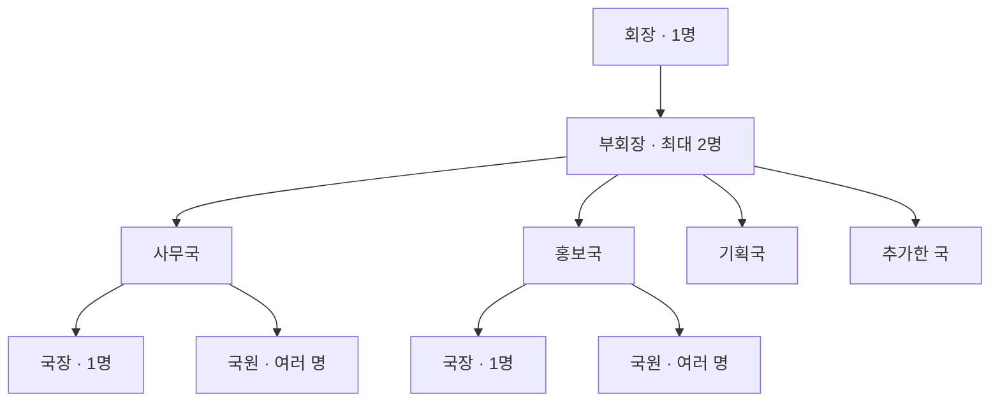

# 학생회 조직도 MVP 설계

> 문서 상태: 제안안 0.1
> 작성일: 2026-08-13
> 대상: Linkit에 가입한 학생회 조직의 기수별 조직도

## 1. 목적

학생회 구성원이 현재 기수의 지휘·협업 구조와 담당자를 한눈에 파악하고, 필요한 경우 연락처를 확인할 수 있게 한다. 조직도 편집자는 회장단과 각 국을 실제 구성원으로 구성하고 다음 기수에도 독립된 조직도를 만들 수 있어야 한다.

이 화면의 핵심은 명단 관리가 아니라 `누가 어느 조직에서 어떤 책임을 맡는가`를 빠르게 이해시키는 것이다. 따라서 기본 표현은 표가 아닌 위계가 드러나는 플로우차트로 한다.

## 2. MVP 범위

### 포함

- 기수별로 독립된 조직도 조회 및 편집
- 회장 1명
- 부회장 최대 2명
- 기본 국: `사무국`, `홍보국`, `기획국`
- 국 추가, 이름 변경, 순서 변경, 삭제
- 국별 국장 1명과 복수 국원
- 구성원의 이름, 프로필 이미지, 직책, 전화번호, 이메일 등록
- 구성원 카드 확장·접기를 통한 연락처 확인
- 권한에 따른 편집 기능 노출과 서버 권한 통제
- 데스크톱·태블릿·모바일 반응형 조회 및 편집

### 제외

- 국 아래 팀·위원회 등 3단계 이상의 하위 조직
- 한 구성원이 같은 기수에서 여러 국을 겸직하는 기능
- 조직도 노드를 자유롭게 끌어 임의 연결하는 다이어그램 편집기
- 외부 사용자에게 공개되는 조직도
- 조직도에서 직접 전화나 이메일을 발송한 이력 관리
- 전임 조직도의 일괄 복제 및 구성원 자동 승계

## 3. 구조와 도메인 규칙



- 조직도는 반드시 하나의 `조직`과 하나의 `기수`에 속한다.
- 한 기수에는 회장이 정확히 한 자리 존재한다. 담당자가 아직 없으면 자리는 `미배정` 상태로 표시한다.
- 부회장 자리는 0~2명까지 배정할 수 있다.
- 각 국에는 국장 자리가 하나 존재하며, 국원 수에는 MVP에서 별도 제한을 두지 않는다.
- 새 기수 조직도를 만들 때 사무국·홍보국·기획국을 기본 생성한다. 이들은 일반 국과 같은 방식으로 이름 변경·순서 변경·삭제할 수 있다.
- 조직도상 직책과 시스템 권한은 별도 개념으로 저장한다. 직책이 바뀌어도 과거 기수 조직도의 기록과 당시 권한 이력이 훼손되면 안 된다.
- 과거 기수 조직도는 기본적으로 읽기 전용 기록으로 보존한다. 다만 조직 관리자는 명백한 오기나 연락처 삭제 요청을 정정할 수 있고, 변경은 감사 로그로 남긴다.

## 4. 화면 정보 구조

### 4.1 상단 영역

1. 페이지 제목 `조직도`
2. 현재 조직명과 기수 선택기
3. 편집 권한 사용자에게만 보이는 `편집` 진입 버튼
4. 조직도 보드 우측 상단의 `+ 국 추가` 버튼

사용자가 제안한 우측 상단 배치는 유지하되, 작은 `+` 아이콘만 사용하면 기능을 추측해야 하므로 다음 형태를 권장한다.

- 데스크톱: 작은 보조 버튼 `+ 국 추가`
- 모바일: 공간이 부족할 때 `+` 아이콘 버튼으로 축약하되 접근성 이름은 `국 추가`
- 편집 모드가 아닐 때는 버튼을 숨겨 조회 화면을 단순하게 유지
- 빈 공간에 항상 떠 있는 FAB보다 보드 제목과 같은 행에 배치하여 버튼의 적용 범위를 명확하게 표현

### 4.2 조직도 보드

```text
┌─────────────────────────────────────────────────────────────┐
│ 조직도                                      [ + 국 추가 ]   │
│                       ┌──────────┐                          │
│                       │   회장   │                          │
│                       └────┬─────┘                          │
│                    ┌───────┴────────┐                       │
│                 ┌──┴───┐         ┌──┴───┐                  │
│                 │부회장│         │부회장│                  │
│                 └──┬───┘         └──┬───┘                  │
│              ┌─────┴──────┬─────────┴──────┐               │
│          ┌───┴───┐    ┌───┴───┐        ┌───┴───┐           │
│          │ 사무국│    │ 홍보국│        │ 기획국│           │
│          │ 국장  │    │ 국장  │        │ 국장  │           │
│          │ 국원들│    │ 국원들│        │ 국원들│           │
│          └───────┘    └───────┘        └───────┘           │
└─────────────────────────────────────────────────────────────┘
```

- 회장 카드를 최상단 중앙에 둔다.
- 부회장 카드는 회장 아래 한 행에 최대 2개를 대칭 배치한다. 한 명일 때는 중앙 정렬한다.
- 각 국은 회장단 아래 동일한 시각적 위계의 열로 배치한다.
- 연결선은 지휘 구조를 나타내되 장식이 되지 않도록 얇고 낮은 대비로 사용한다.
- 국이 많아지면 데스크톱에서는 보드 내부 가로 스크롤을 허용한다. 전체 페이지가 옆으로 밀리면 안 된다.
- 사용자가 임의로 선을 연결하는 기능은 제공하지 않는다. 데이터 구조로부터 레이아웃을 자동 생성해 구조 오류를 방지한다.

### 4.3 구성원 카드

접힌 상태에는 다음만 표시한다.

- 프로필 이미지 또는 이름 이니셜 대체 이미지
- 이름
- 직책
- 펼치기 버튼

카드를 누르거나 펼치기 버튼을 선택하면 카드가 같은 위치에서 세로로 확장되며 다음 정보를 표시한다.

- 전화번호
- 이메일 주소
- 전화 걸기와 메일 작성 링크
- 편집 권한 사용자에게만 보이는 `구성원 수정` 메뉴

연락처는 기본적으로 접어 화면 밀도를 낮추고 불필요한 노출을 줄인다. 호버만으로 열지 않으며, 카드 헤더는 키보드로 조작 가능한 버튼 역할을 하고 `aria-expanded`와 연결된 상세 영역을 제공한다. 한 카드를 펼쳐도 다른 카드를 자동으로 닫지 않아 여러 구성원의 연락처를 비교할 수 있게 한다.

## 5. 주요 상호작용

### 5.1 기수 전환

- 상단 선택기에서 기수를 바꾸면 해당 기수의 조직도를 다시 불러온다.
- 기본 선택은 현재 진행 중인 기수다.
- 과거 기수에는 `지난 기수` 상태를 명시하고 일반 편집 버튼을 숨긴다.
- 저장하지 않은 수정이 있는 상태에서 기수를 바꾸면 이탈 확인을 요청한다.

### 5.2 국 추가

1. 편집 모드에서 `+ 국 추가`를 선택한다.
2. 작은 다이얼로그에서 국 이름을 입력한다.
3. 공백을 제거한 이름이 같은 기수에 이미 존재하면 `이미 존재하는 국 이름입니다.`를 표시한다.
4. 저장에 성공하면 새 국을 보드 마지막에 추가하고 해당 카드로 초점을 이동한다.
5. 새 국의 국장 자리는 `미배정`, 국원 목록은 빈 상태로 시작한다.

국 추가는 빈 카드부터 먼저 만들고 나중에 구성원을 배치할 수 있어야 한다. 국 이름과 국장 정보를 한 번에 요구하면 초기 설정 부담이 커진다.

### 5.3 국 삭제

- 국 카드의 더보기 메뉴에서 `국 삭제`를 제공한다.
- 국장이나 국원이 배정된 국은 즉시 삭제할 수 없다. 먼저 구성원을 다른 국으로 이동하거나 미배정 상태로 옮기도록 안내한다.
- 빈 국을 삭제할 때는 국 이름과 영향을 확인하는 확인창을 표시한다.
- 서버에서는 물리 삭제보다 보관 상태로 전환하고 감사 로그를 남긴다.
- 삭제 후에는 다음 국 카드 또는 `+ 국 추가` 버튼으로 초점을 이동한다.

### 5.4 구성원 배정

- 빈 직책의 `구성원 배정` 버튼 또는 국 카드의 `국원 추가` 버튼으로 시작한다.
- 이미 해당 조직에 가입한 현재 기수 구성원을 검색해 선택하는 방식을 기본으로 한다.
- 프로필 이미지, 전화번호, 이메일은 사용자 계정의 프로필을 참조하되 조직도에 공개할 연락처는 사용자가 확인·동의한 값만 표시한다.
- 부회장이 2명 배정된 상태에서는 추가 버튼을 비활성화하고 `부회장은 최대 2명까지 등록할 수 있습니다.`를 안내한다.
- 회장 또는 국장 자리에 새 사람을 배정하면 기존 담당자의 이동 또는 해제를 확인한다.

### 5.5 순서 변경

- 국의 좌우 순서는 편집 모드에서 드래그하거나 `왼쪽으로 이동`, `오른쪽으로 이동` 메뉴로 변경한다.
- 키보드 사용자를 위해 드래그 외 대체 조작을 반드시 제공한다.
- 변경된 순서는 자동 저장하고 `저장됨` 상태를 짧게 표시한다.

## 6. 권한

### 6.1 역할 구분

| 역할 | 현재 기수 조회 | 연락처 조회 | 현재 기수 편집 | 과거 기수 정정 |
|---|:---:|:---:|:---:|:---:|
| 조직의 승인된 일반 구성원 | O | O | X | X |
| 현재 기수 회장 | O | O | O | X |
| 현재 기수 부회장 | O | O | O | X |
| 현재 기수 국장 | O | O | O | X |
| 조직 관리자 | O | O | O | O |
| 조직 외 사용자 | X | X | X | X |

사용자가 말한 `전 임기의 회장·부회장·국장`은 직책 종료와 동시에 영구 관리자가 되는 구조보다 명시적인 `조직 관리자` 권한을 부여받은 경우에만 계속 편집할 수 있도록 설계한다. 그렇지 않으면 기수가 누적될수록 관리자 수가 무제한 증가한다. 전임 임원에게 조직 관리자 권한을 자동 부여할지는 운영 정책으로 별도 확정해야 한다.

### 6.2 서버 통제

- 모든 조회 요청에서 조직 멤버십과 기수 접근 권한을 확인한다.
- 연락처 응답은 조직 외 사용자에게 절대 포함하지 않는다. 프론트에서 접어두는 것만으로 개인정보를 보호했다고 간주하지 않는다.
- 모든 추가·수정·삭제 요청에서 서버가 현재 직책 또는 조직 관리자 권한을 재검증한다.
- 구성원, 직책, 국, 연락처 변경은 행위자·대상·이전 값·새 값·기수를 감사 로그에 기록한다.
- 다른 조직이나 기수의 ID를 요청에 넣는 IDOR 공격을 통합 테스트에 포함한다.

## 7. 개인정보 원칙

- 전화번호와 이메일은 조직의 승인된 구성원에게만 공개한다.
- 구성원이 각 연락 수단의 조직도 공개 여부를 선택할 수 있게 한다.
- 공개 동의가 없는 값은 편집자에게도 보여주지 않고 `비공개`로 표시한다.
- 전화번호는 화면에서 읽기 쉬운 형식으로 표시하되 저장·전송 규칙은 일관되게 정규화한다.
- 프로필 이미지가 없거나 로딩에 실패하면 이름 이니셜을 사용한다.
- 과거 기수의 연락처는 기본적으로 가리고, 감사·업무상 필요성이 확정되기 전에는 이름과 당시 직책만 보존하는 방안을 권장한다.

## 8. 반응형 동작

### 데스크톱

- 전체 플로우차트를 한 보드에 표시한다.
- 회장단을 중앙에 고정하고 각 국을 가로로 펼친다.
- 국이 화면 폭을 넘으면 보드 내부 가로 스크롤과 가장자리 페이드로 추가 콘텐츠를 알린다.

### 태블릿

- 회장단은 상단 중앙을 유지한다.
- 국은 2열 카드 그리드로 전환하되 연결선은 공통 분기점까지만 단순화한다.

### 모바일

- 의미 없는 축소판 플로우차트를 만들지 않는다.
- `회장 → 부회장 → 각 국` 순서의 세로 트리로 바꾼다.
- 국 카드는 아코디언처럼 국장과 국원을 접을 수 있다.
- 구성원 연락처 확장 방식은 데스크톱과 동일하게 유지한다.
- `국 추가`는 보드 헤더 우측의 아이콘 버튼으로 축약하고 스크롤에 따라 떠다니는 FAB는 사용하지 않는다.

## 9. 상태와 오류

| 상태 | 표현과 다음 행동 |
|---|---|
| 최초 생성 | 기본 3개 국과 모든 직책의 `미배정` 자리, `구성원 배정` 안내 |
| 국원 없음 | 국장 아래 `아직 등록된 국원이 없습니다.`와 편집자용 추가 버튼 |
| 로딩 | 조직도 전체 크기를 보존하는 스켈레톤으로 레이아웃 이동 방지 |
| 저장 중 | 보드 상단에 방해되지 않는 `저장 중` 상태 |
| 저장 완료 | 짧은 `저장됨` 피드백, 별도 성공 팝업은 사용하지 않음 |
| 저장 실패 | 변경 내용을 유지하고 `저장하지 못했습니다. 다시 시도` 제공 |
| 권한 없음 | 편집 UI 제거와 함께 서버 `403`; 직접 URL 접근에도 동일 적용 |
| 구성원 탈퇴 | 당시 기록은 이름·직책으로 보존하고 연락처와 프로필은 비공개 처리 |
| 동시 수정 | 버전 충돌 시 덮어쓰지 않고 최신 조직도 새로고침 또는 재적용 안내 |
| 국이 많음 | 보드 내부 스크롤, 모바일 세로 목록, 국 이름 검색은 이후 검토 |

## 10. 데이터 모델 초안

```text
OrganizationTerm
- id
- organizationId
- name
- startsAt / endsAt
- status

OrganizationChart
- id
- organizationId
- termId (unique)
- version
- createdAt / updatedAt

Department
- id
- chartId
- name
- sortOrder
- status

ChartAssignment
- id
- chartId
- departmentId (회장·부회장은 null)
- membershipId
- position: PRESIDENT | VICE_PRESIDENT | DIRECTOR | MEMBER
- sortOrder
- createdAt / updatedAt

MemberContactVisibility
- membershipId
- phoneVisibleToOrganization
- emailVisibleToOrganization
```

- 현재 구성원 정보는 `Membership`을 참조하고, 과거 기록 보존을 위해 배정 당시 표시 이름과 직책 스냅샷을 함께 저장하는 방안을 권장한다.
- `OrganizationChart.version`으로 낙관적 잠금을 적용해 동시 수정 덮어쓰기를 방지한다.
- DB 제약과 서비스 검증으로 기수별 회장 1명, 부회장 최대 2명, 국별 국장 최대 1명을 보장한다.

## 11. API 초안

| Method | Path | 설명 |
|---|---|---|
| GET | `/api/v1/organizations/{organizationId}/terms` | 기수 목록 조회 |
| POST | `/api/v1/organizations/{organizationId}/terms/{termId}/chart` | 해당 기수 조직도 최초 생성 |
| GET | `/api/v1/organizations/{organizationId}/terms/{termId}/chart` | 권한 범위의 조직도 조회 |
| POST | `/api/v1/organization-charts/{chartId}/departments` | 국 추가 |
| PATCH | `/api/v1/departments/{departmentId}` | 국 이름·순서 변경 |
| DELETE | `/api/v1/departments/{departmentId}` | 빈 국 보관 처리 |
| POST | `/api/v1/organization-charts/{chartId}/assignments` | 구성원 배정 |
| PATCH | `/api/v1/chart-assignments/{assignmentId}` | 직책·국·순서 변경 |
| DELETE | `/api/v1/chart-assignments/{assignmentId}` | 구성원 배정 해제 |
| PATCH | `/api/v1/memberships/{membershipId}/contact-visibility` | 연락처 공개 범위 변경 |

조직도 조회 응답은 기본 프로필과 공개된 연락처를 함께 반환해 카드마다 추가 요청을 발생시키지 않는다. 다만 권한 없는 요청에는 연락처 필드 자체를 제외한다.

## 12. 접근성 및 모션

- 플로우차트의 시각적 위치와 무관하게 DOM과 스크린 리더 읽기 순서는 `회장 → 부회장 → 국 → 국장 → 국원`으로 유지한다.
- 연결선에만 계층 의미를 의존하지 않고 제목과 직책 텍스트를 제공한다.
- 모든 아이콘 버튼에 보이는 툴팁과 접근성 이름을 제공한다.
- 카드 확장은 150~200ms 수준의 짧은 높이·투명도 전환으로 맥락을 유지하되 `prefers-reduced-motion`에서는 즉시 전환한다.
- 포커스 표시, 키보드 순서, 드래그 대체 조작, 오류 메시지 연결을 필수 구현 조건으로 둔다.

## 13. 검증 기준

- 새 기수 조직도를 만들면 기본 3개 국이 표시된다.
- 회장 1명, 부회장 최대 2명, 국별 국장 1명 규칙을 서버가 강제한다.
- 편집자는 국과 구성원을 추가·수정·정렬·해제할 수 있다.
- 구성원 카드를 펼치면 공개가 허용된 전화번호와 이메일만 확인할 수 있다.
- 일반 구성원은 조회할 수 있지만 편집 API 요청은 거부된다.
- 조직 외 사용자는 조직도와 연락처를 조회할 수 없다.
- 다른 기수의 조직도는 독립적으로 보존된다.
- 모바일에서 가로 확대 없이 전체 계층과 연락처에 접근할 수 있다.
- 국 삭제, 권한 우회, 동시 수정, 탈퇴 구성원 상태에 대한 자동화 테스트가 통과한다.

## 14. 구현 전 확정할 결정

1. 전임 회장·부회장·국장에게 조직 관리자 권한을 자동 부여할지, 현 관리자가 명시적으로 지정할지
2. 과거 기수에서 전화번호·이메일을 계속 공개할지, 임기 종료 즉시 숨길지
3. 현재 MVP의 `Membership`이 기수와 직책을 표현하도록 확장 가능한지
4. 한 구성원의 겸직을 MVP에서 정말 금지할지, 회장단과 국 직책의 겸직만 예외로 허용할지데
5. 기수 생성과 조직도 최초 생성 권한을 누가 갖는지

권장 기본값은 `조직 관리자는 명시적으로 지정`, `과거 기수 연락처는 숨김`, `겸직은 MVP에서 금지`다. 이 세 원칙이 권한 누적, 개인정보 장기 노출, 복잡한 플로우차트 표현을 가장 효과적으로 막는다.
